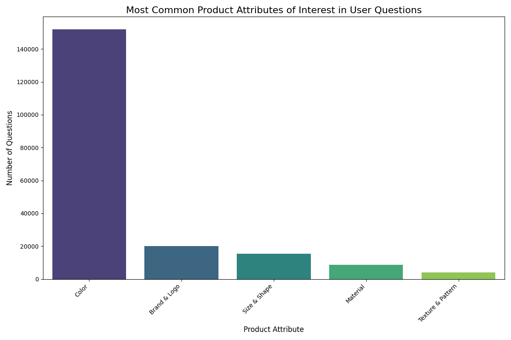
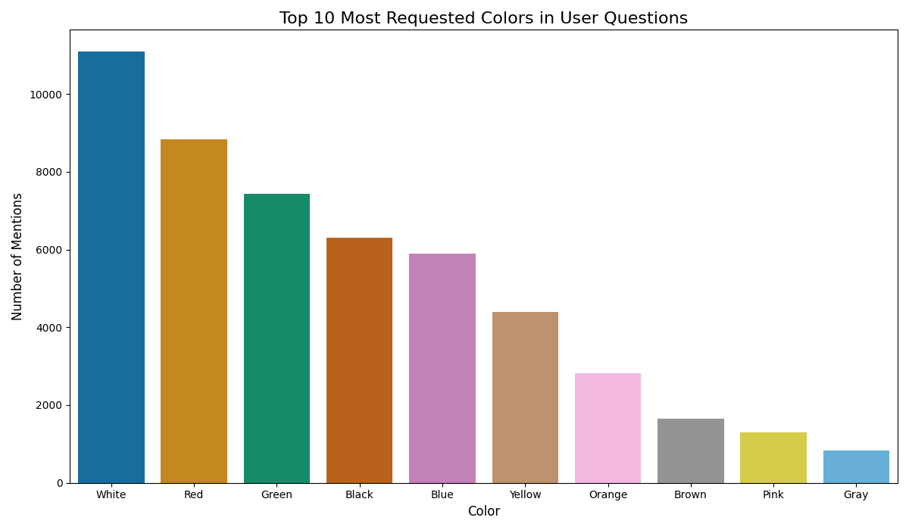

# E-commerce Product Visual Question Answering (VQA) Analysis

## 📝 Overview
This project analyzes user query patterns from the **VQA v2.0 dataset** to simulate how an e-commerce platform could optimize its customer experience. The goal is to understand what users ask about products and identify potential weaknesses in a VQA system. All analysis is contained within a single Jupyter Notebook.

---

## 🚀 Key Tasks Performed
- **Data Exploration**: Loaded and inspected the structure of all question, answer, and complementary pair files.
- **Query Pattern Analysis**: Analyzed the most common types of questions and product attributes (color, material, size) users are interested in.
- **Weakness Identification**: Identified "unanswered" or "poorly answered" questions by analyzing answer agreement and confidence scores.
- **Merchandising Reports**: Generated a data-driven PDF report for a simulated merchandising team, highlighting the "most requested colors".
- **Business Impact Simulation**: Outlined a framework for measuring the business impact (CTR, A/B testing) of a VQA system in a live environment.

---

## 🗂️ Dataset
- The VQA annotation files are not included in this repository. Please download the data from the official [**VQA dataset website**](https://visualqa.org/download.html).

---

## 📖 Usage
All the analysis, from data loading to final reporting, is performed within the **`VQA_Analysis_Notebook.ipynb`** file. Open this notebook in Jupyter or Google Colab and run the cells sequentially to reproduce the results.

---

## 🔗 Colab Notebook Link
[VQA.ipynb](https://colab.research.google.com/drive/1Kwa1nYpH6daUNB4_zHTsJjsLlIK_YyV7?usp=sharing)

---

## ✨ Key Findings
A key finding was that **color** is the most frequently queried product attribute. The report generated in the notebook provides detailed recommendations for a merchandising team based on the top 10 most requested colors.

